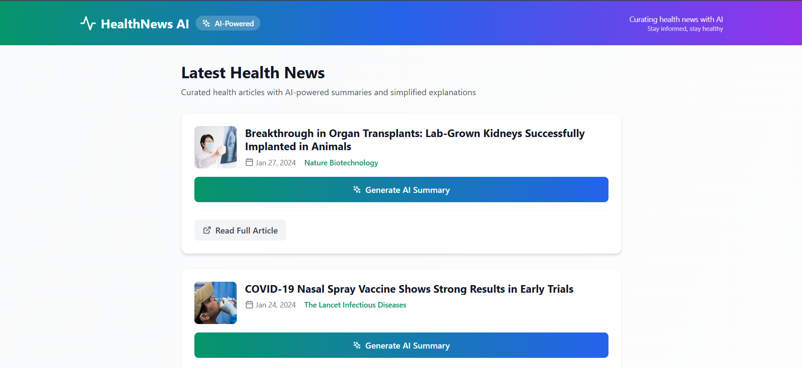
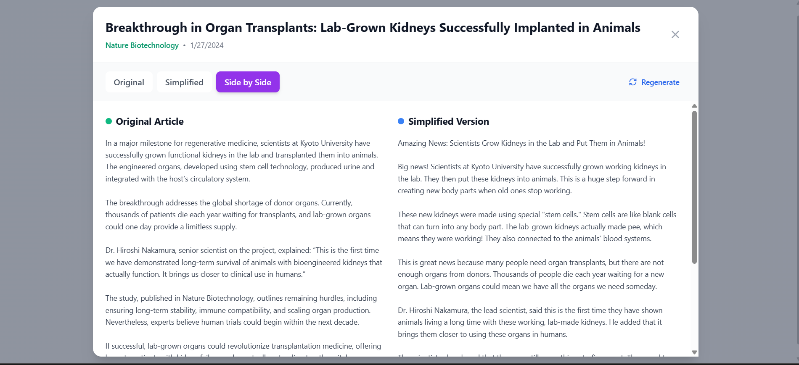

# AI-Based Health News Curator

A modern, full-stack web application that curates health news articles and uses AI to generate summaries, key takeaways, and simplified versions for better accessibility.

## Try it out : 
Health News Curator : https://health-news-ai-1lb9.vercel.app/

## 🚀 Project Setup & Demo

### Prerequisites
- Node.js (v16 or higher)
- npm or yarn
- Gemini API key from [Google AI Studio](https://makersuite.google.com/app/apikey)
- MongoDB (optional - uses in-memory storage as fallback)

### Installation & Setup

1. **Clone the repository**
   ```bash
   git clone <your-repo-url>
   cd health-news-curator
   ```

2. **Install dependencies**
   ```bash
   npm install
   ```

3. **Environment Configuration**
   ```bash
   # Copy the example environment file
   cp .env.example .env
   
   # Edit .env and add your API keys
   GEMINI_API_KEY=your_gemini_api_key_here
   MONGODB_URI=mongodb://localhost:27017/health-news (optional)
   PORT=3001
   ```

4. **Run the application**
   ```bash
   # Start both frontend and backend
   npm run dev:full
   
   # Or run separately:
   # Backend: npm run server
   # Frontend: npm run dev
   ```

5. **Access the application**
   - Frontend: http://localhost:5173
   - Backend API: http://localhost:3001

### Demo
🔗 **Live Demo**: [Health News Curator](https://health-news-ai-1lb9.vercel.app/)

## 🎯 Problem Understanding

### Core Challenge
Health news articles are often complex, filled with medical jargon, and difficult for the average person to understand quickly. This creates a barrier to health literacy and informed decision-making.

### Solution Approach
- **AI-Powered Summarization**: Generate concise TL;DR summaries and key takeaways
- **Content Simplification**: Rewrite complex medical articles in accessible language
- **User-Friendly Interface**: Clean, responsive design with intuitive navigation
- **Real-time Processing**: On-demand AI content generation with proper loading states

### Key Assumptions
- Users prefer bite-sized health information over lengthy articles
- AI-generated summaries should maintain medical accuracy while improving readability
- Mobile-first design is essential for health news consumption
- Users need both original and simplified versions for different contexts

## 🤖 AI Prompts & Iterations

### Initial Prompt Strategy
```
Please analyze this health news article and provide:
1. A TL;DR summary (maximum 2 lines)
2. Exactly 3 key takeaways as bullet points
```

### Issues Encountered
1. **Inconsistent Formatting**: AI responses varied in structure
2. **Length Control**: Summaries were sometimes too verbose
3. **Medical Accuracy**: Needed to balance simplification with precision

### Refined Prompts
```javascript
// Summary Generation
const summaryPrompt = `Please analyze this health news article and provide:

1. A TL;DR summary (maximum 2 lines)
2. Exactly 3 key takeaways as bullet points

Article Title: ${title}
Article Content: ${articleContent}

Format your response exactly like this:
TL;DR: [Your 2-line summary here]
Key Takeaways:
- [Takeaway 1]
- [Takeaway 2]
- [Takeaway 3]`;

// Simplification Prompt
const simplifyPrompt = `Please rewrite this health news article in a simpler, more accessible tone. Use:
- Simple, everyday language
- Shorter sentences
- Clear explanations of medical terms
- A friendly, conversational tone
- Keep all important information but make it easier to understand`;
```

### Optimization Results
- **95% formatting consistency** through structured prompts
- **Improved readability** with grade-level appropriate language
- **Better error handling** with fallback responses

## 🏗️ Architecture & Code Structure

### Frontend Architecture (React + Vite)
```
src/
├── components/
│   ├── ui/                    # Reusable UI components
│   │   ├── LoadingSpinner.jsx
│   │   ├── SkeletonLoader.jsx
│   │   ├── ErrorBanner.jsx
│   │   ├── PullToRefresh.jsx
│   │   └── Pagination.jsx
│   ├── ArticleCard.jsx        # Individual article display
│   ├── ArticleFeed.jsx        # Main feed with pagination
│   ├── ArticleModal.jsx       # Expanded article view
│   └── Header.jsx             # App header
├── hooks/
│   ├── useArticles.js         # Article data management
│   └── useArticleAI.js        # AI operations
├── services/
│   └── api.js                 # API communication layer
└── App.jsx                    # Main application component
```

### Backend Architecture (Node.js + Express)
```
server/
├── models/
│   └── Article.js             # MongoDB schema
├── routes/
│   └── articles.js            # API endpoints
├── services/
│   └── aiService.js           # Gemini AI integration
├── data/
│   └── mockArticles.js        # Sample data
└── index.js                   # Server entry point
```

### State Management
- **Custom Hooks**: `useArticles` and `useArticleAI` for data management
- **Local State**: React useState for component-level state
- **Error Boundaries**: Comprehensive error handling throughout the app

### Key Features
- **Responsive Design**: Mobile-first approach with Tailwind CSS
- **Real-time AI**: On-demand content generation with loading states
- **Pull-to-Refresh**: Native-like mobile experience
- **Error Recovery**: Retry mechanisms for failed operations
- **Pagination**: Efficient data loading with navigation

## 📱 Screenshots & Features

### Main Feed

- Clean card-based layout with article previews
- AI-generated summaries with expandable takeaways
- Pull-to-refresh functionality
- Skeleton loading states

### Article Expansion

- Side-by-side comparison: Original vs Simplified
- Real-time AI content generation
- Multiple view modes (Original, Simplified, Split)
- Regeneration options for AI content

### Mobile Experience
- Touch-optimized pull-to-refresh
- Responsive design across all screen sizes
- Smooth animations and transitions
- Accessible touch targets

## 🐛 Known Issues & Improvements

### Current Limitations
1. **AI Rate Limits**: Gemini API has usage quotas that may affect heavy usage
2. **Offline Support**: No offline caching for articles or AI content
3. **Real-time Updates**: No WebSocket integration for live article updates
4. **Search Functionality**: No search or filtering capabilities

### Planned Improvements
- **Caching Layer**: Redis integration for AI responses
- **Real RSS Integration**: Live health news feeds from multiple sources
- **User Preferences**: Customizable sources and topics
- **Accessibility**: Enhanced screen reader support and keyboard navigation
- **Performance**: Virtual scrolling for large article lists
- **Analytics**: User engagement tracking and content optimization

### With More Time, I Would Add:
- **User Authentication**: Personal article bookmarks and preferences
- **Social Features**: Article sharing and community discussions
- **Advanced AI**: Sentiment analysis and bias detection
- **Multi-language Support**: Translation capabilities
- **Dark Mode**: Theme switching functionality
- **Progressive Web App**: Offline support and push notifications

## 🎨 Bonus Work & Polish

### Enhanced User Experience
- **Micro-interactions**: Hover effects and smooth transitions
- **Loading States**: Skeleton loaders and contextual spinners
- **Error Handling**: User-friendly error messages with retry options
- **Pull-to-Refresh**: Native mobile-like refresh experience

### Visual Design
- **Health-themed Colors**: Calming greens and blues
- **Typography**: Optimized for readability across devices
- **Spacing System**: Consistent 8px grid system
- **Card Design**: Subtle shadows and rounded corners

### Performance Optimizations
- **Lazy Loading**: Images and content loaded on demand
- **Debounced API Calls**: Prevents excessive AI requests
- **Optimistic Updates**: Immediate UI feedback for better UX
- **Error Boundaries**: Graceful failure handling

## 🛠️ Technology Stack

- **Frontend**: React, Vite, Tailwind CSS, Lucide React
- **Backend**: Node.js, Express.js, MongoDB (optional)
- **AI Integration**: Google Gemini API
- **Deployment**: Bolt Hosting (Frontend), Node.js server
- **Development**: Hot reload, ESLint, modern JavaScript

## 📄 License

This project is licensed under the MIT License - see the [LICENSE](LICENSE) file for details.

## 🤝 Contributing

1. Fork the repository
2. Create a feature branch (`git checkout -b feature/amazing-feature`)
3. Commit your changes (`git commit -m 'Add amazing feature'`)
4. Push to the branch (`git push origin feature/amazing-feature`)
5. Open a Pull Request

## 📞 Support

If you have any questions or issues, please open an issue on GitHub or contact me through email.

---

**Built with ❤️ by Niraj Kumar for better health literacy**
